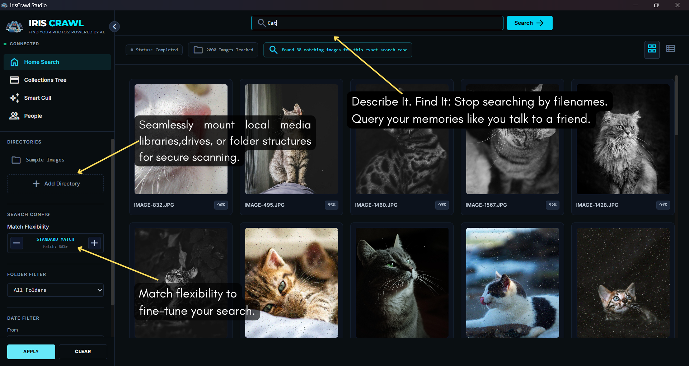
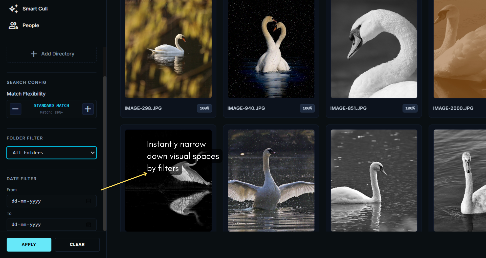
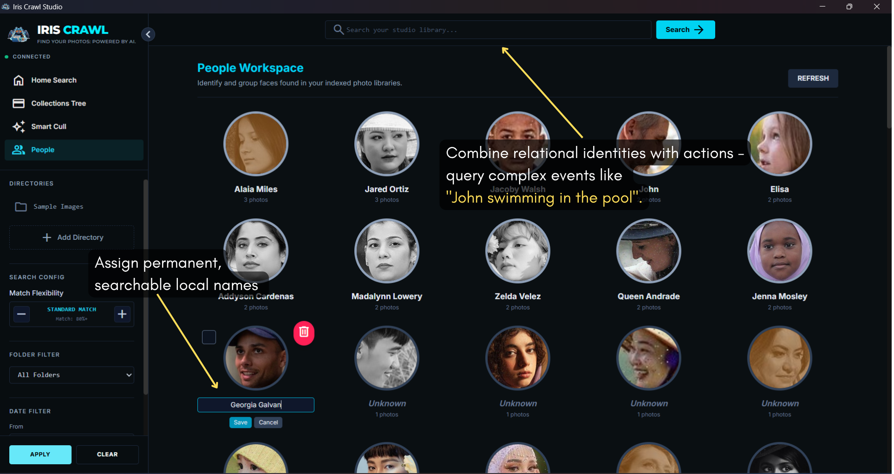

  
  <h1>IrisCrawl Studio</h1>
  
<em>Find Your Photos: Powered by AI.</em>

  <!-- GitHub Release Badges -->
  
  
   
  

 

Welcome to **IrisCrawl Studio**—a powerful **privacy-first image crawler** and **desktop asset manager** designed to fundamentally change how you interact with your digital memories. Built entirely for your local machine, IrisCrawl acts as an **offline semantic image search** engine, allowing you to find deeply buried photos using nothing but natural language.

Whether you're looking to consolidate decades of scattered photography, implement **facial recognition cataloging** for your family portraits, or simply need a robust **AI photo search** utility, IrisCrawl ensures your data never leaves your hard drive. 

---

## 🏷️ Recommended GitHub Topics
`desktop-app`, `ai-photo-search`, `semantic-search`, `cross-platform`, `local-ai`, `privacy-first`, `face-recognition`, `photo-manager`

---

## 🧠 Architectural Overview

IrisCrawl Studio achieves high performance by leveraging a completely localized runtime environment optimized for consumer hardware.

1. **Native Desktop Shell**: Orchestrates the secure application window lifecycle with minimal system footprint.
2. **Proprietary Offline Processing Engine**: A fully compiled, embedded module executing visual computational tasks directly on your machine.
3. **Encrypted Secure IPC Engine**: Manages asynchronous communication pipelines between the application interface and the core data layer.
4. **Local Structural Image Index**: Keeps your asset metadata tightly indexed directly on-disk without calling out to secondary networks.
5. **Private Native Search Pipeline**: Computes relationships between text strings and image files entirely on your device.

---

## ⚡ Core Engine Features

| Feature | Description |
| --- | --- |
| 🗣️ **Natural Language Semantic Prompts** | Stop searching by file names. Search for descriptive phrases like *"dog running on a beach at sunset"* or *"red car in the snow"* and watch the system retrieve exact visual matches instantly. |
| 🗂️ **Facial Recognition Clustering** | Automatically scans and groups matching face profiles into clean, searchable identities across your entire catalog. |
| ✨ **Automated Smart Culling** | Intelligently detects and stacks near-identical burst shots or low-quality frame captures, allowing you to instantly clear gigabytes of wasted storage. |
| 🛡️ **Zero-Network Privacy Protocols** | 100% offline security. Your images are crawled locally, indexed locally, and searched locally. No cloud telemetry, no data collection. |

---

## 🚀 Step-by-Step User Runway

Ready to experience completely offline semantic visual searching? 

### 1. Download the Installer
Head over to the [GitHub Releases](https://github.com/kolapraneeth22/iriscrawl-studio/releases/latest) page to grab the latest compiled installer payload.
- Choose [IrisCrawl.Studio_0.1.0_x64-setup.exe](https://github.com/kolapraneeth22/iriscrawl-studio/releases/download/v0.1.0/Iris.Crawl.Studio_0.1.0_x64-setup.exe) (Standard Windows Installer)
- Or choose [IrisCrawl.Studio_0.1.0_x64_en-US.msi](https://github.com/kolapraneeth22/iriscrawl-studio/releases/download/v0.1.0/Iris.Crawl.Studio_0.1.0_x64_en-US.msi) (MSI Database Installer)

### 2. Run the Setup
Run the downloaded file to install IrisCrawl Studio seamlessly onto your machine. 

### 3. Launch the Studio
When you boot IrisCrawl Studio for the first time, the initialization screen will prepare the local environment space and allocate device resources. Within 45 seconds, the primary interface will appear—completely disconnected from the internet and ready to securely index your chosen media directories.

---
---

## 📸 Interactive Application Interface Tour

Explore how IrisCrawl Studio maps, processes, and unlocks your local visual data completely offline. Click on a section below to expand the interface screens.

  
🗺️ 1. Onboarding & High-Speed Local Indexing (2 Screens)

   
  

    
     <em>Mount local media folders or drives securely.</em>  
    
     <em>Monitor background ingestion metrics and throughput in real-time.</em>
  

  
🗣️ 2. Advanced Semantic Search & Parameter Calibration (2 Screens)

   
  

    
     <em>Query visual content using standard natural human phrases instead of filenames.</em>  
    
     <em>Instantly narrow results down by specific timelines or file paths.</em>
  

  
🗂️ 3. Localized Facial Recognition Workspace (2 Screens)

   
  

    
     <em>Tag individual profiles and execute relational event queries safely on-disk.</em>  
    
     <em>Effortlessly merge matching facial profiles at scale.</em>
  

  
✨ 4. Storage Management & Asset Syncing (2 Screens)

   
  

    
     <em>Sync newly added media quickly without re-scanning the entire catalog.</em>  
    
     <em>Detect burst sequences or duplicate assets to save space.</em>
  

---

## ⚙️ Minimum System Allocations

Because IrisCrawl Studio runs **intensive AI processing** entirely via your system hardware, please ensure your setup meets our baseline requirements for a smooth experience.

| Requirement | Minimum Allocation | Recommended Allocation |
| --- | --- | --- |
| **Operating System** | Windows 10 x64 Architecture | Windows 11 x64 Architecture |
| **Processor (CPU)** | Intel Core i5 / AMD Ryzen 5 | Intel Core i7 / AMD Ryzen 7+ |
| **Memory (RAM)** | 8 GB System RAM | 16 GB System RAM |
| **Storage (Disk)** | 500 MB for Application & Assets | Fast NVMe SSD for instant results retrieval |
| **Indexing Speed** | ~3-5 images per second | ~10-15+ images per second |

---

  
Built with ❤️ for privacy and precision.

